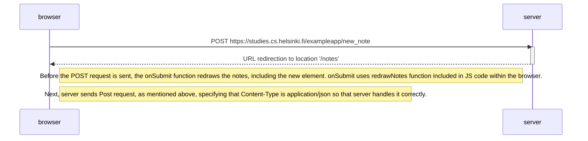

# Fullstack open

## Egor Kovalenko

```mermaid
sequenceDiagram
    participant browser
    participant server

    browser->>server: POST https://studies.cs.helsinki.fi/exampleapp/new_note
    activate server
    server-->>browser: URL redirection to location '/notes'
    deactivate server

    Note right of browser: Before the POST request is sent, the onSubmit function redraws the notes, including the new element. onSubmit uses redrawNotes function included in JS code within the browser.
    Note right of browser: Next, server sends Post request, as mentioned above, specifying that Content-Type is application/json so that server handles it correctly.
```
